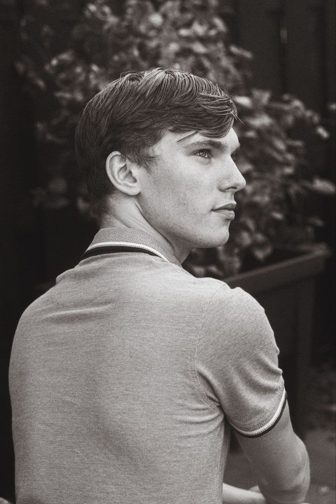
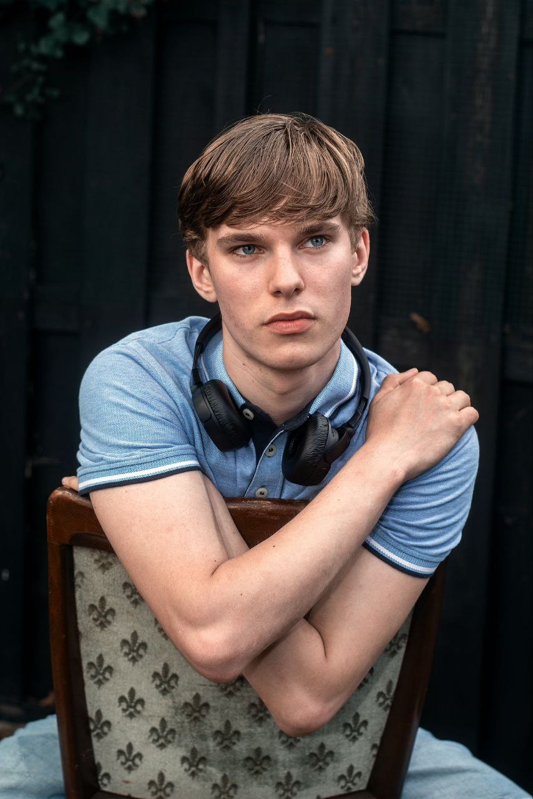
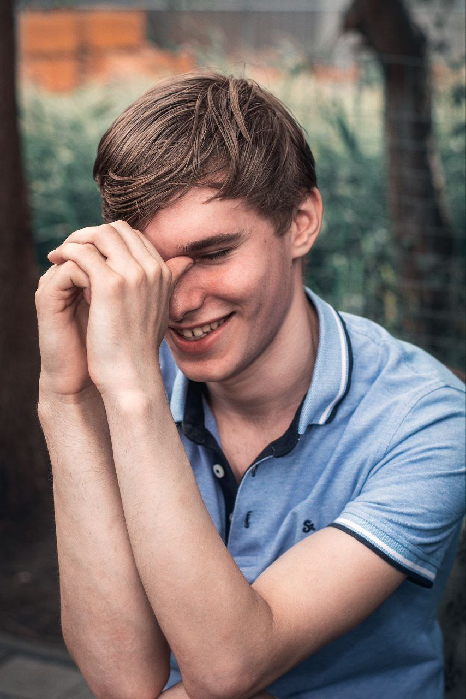
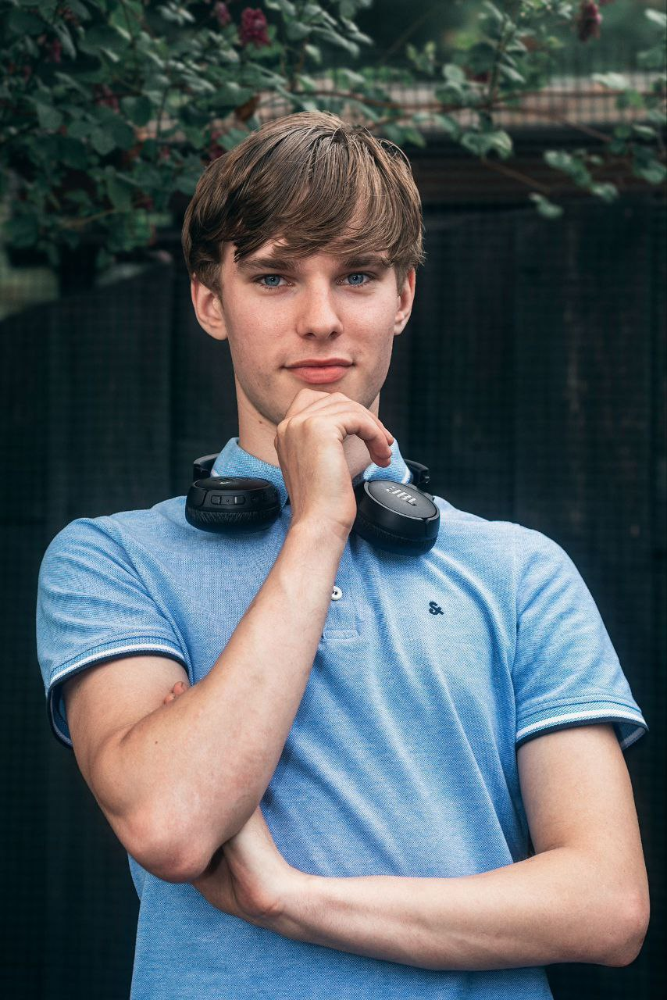
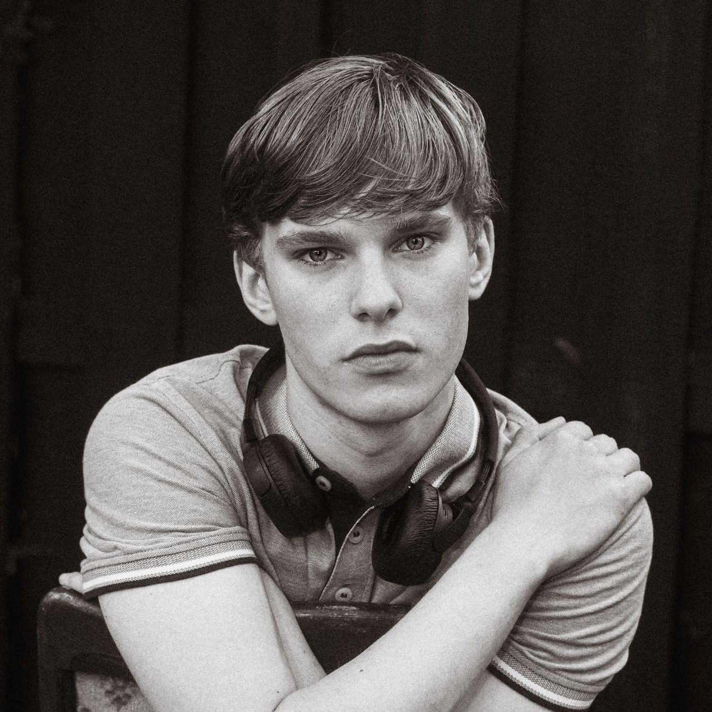

# Привет, меня зовут Родион! 👋

## 🛠 Технологии и инструменты:

## 📊 GitHub Статистика:

## 🏆 Достижения

## 🚀 Проекты
- [-DecentralizedClient](https://github.com/radik097/-DecentralizedClient) - Краткое описание проекта.

## 📫 Связаться со мной:

## Фото коллаж

  
  
  
  
  
  
  
  
  
  

